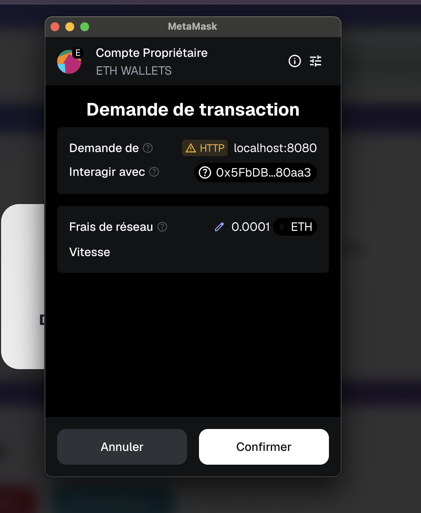
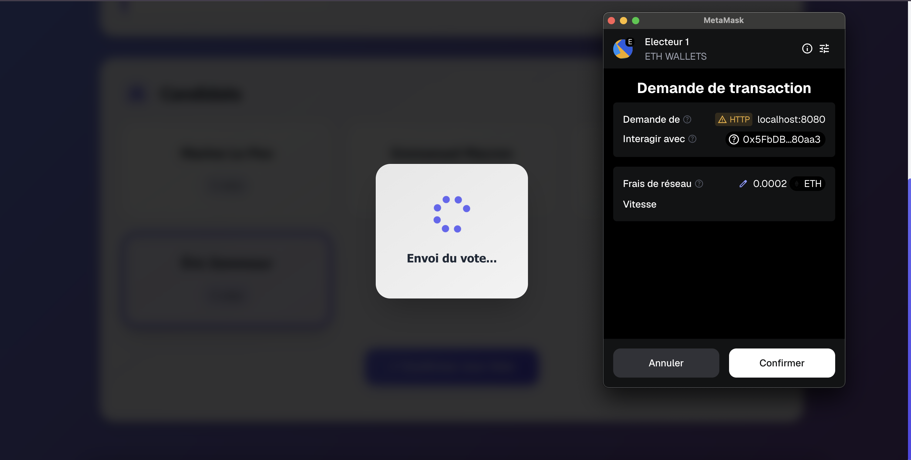
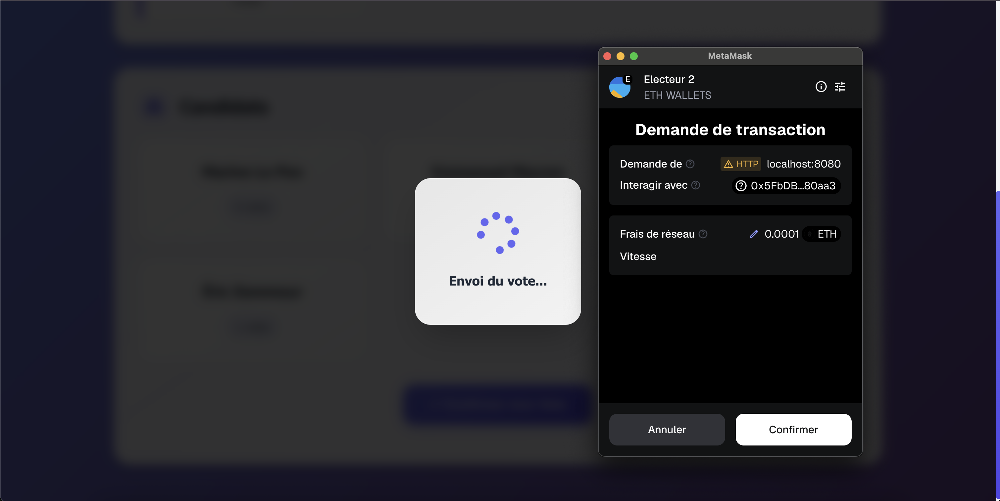
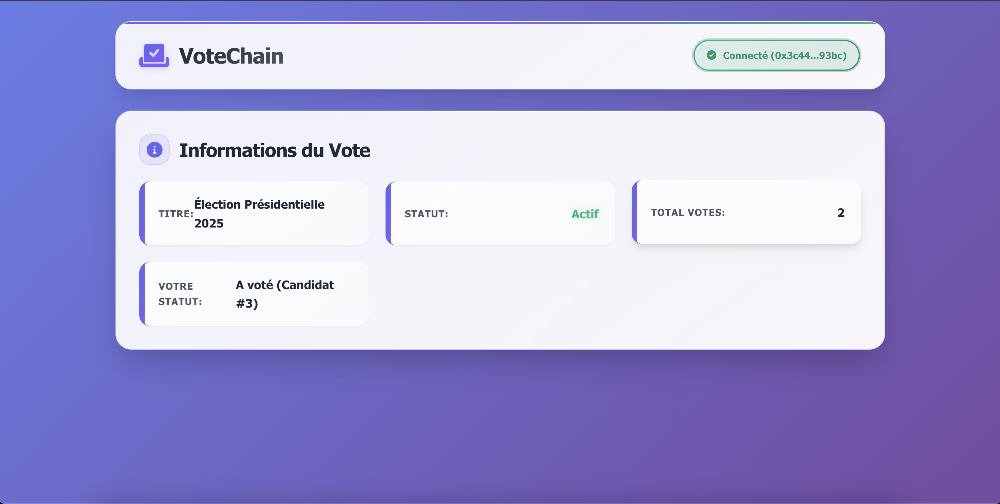
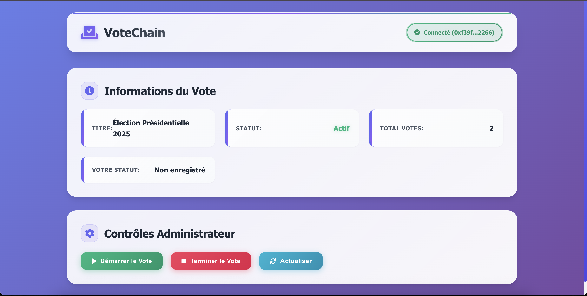
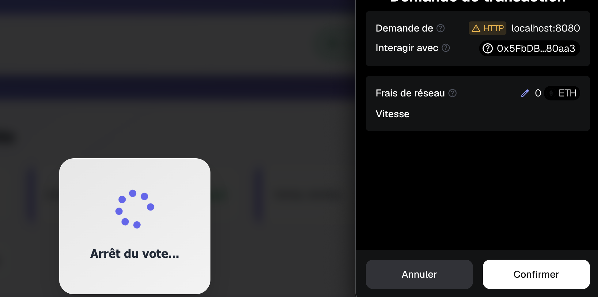
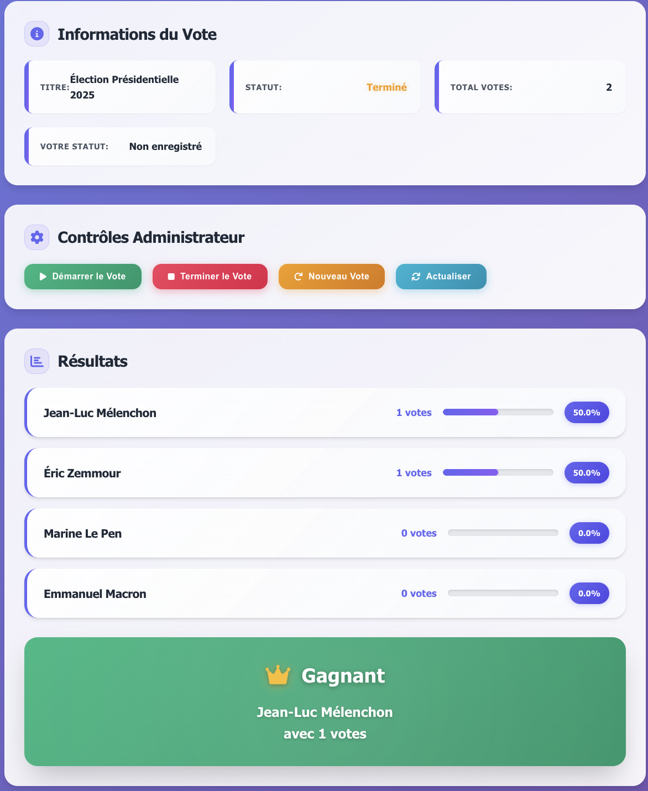

# 🗳️ VoteChain - Système de Vote Blockchain

[](https://soliditylang.org/)
[](https://hardhat.org/)
[](https://docs.ethers.io/)
[](LICENSE)

Un système de vote sécurisé, transparent et décentralisé basé sur la blockchain Ethereum, développé avec Solidity et une interface web moderne. VoteChain garantit l'intégrité des élections en utilisant la technologie blockchain pour prévenir la fraude et assurer la transparence.

## 🌟 Fonctionnalités Principales

### 🔐 Sécurité Blockchain
- **Vote immuable** : Chaque vote est enregistré de manière permanente sur la blockchain
- **Transparence totale** : Tous les votes et résultats sont publiquement vérifiables
- **Prévention de la fraude** : Protection contre le double-vote et la manipulation
- **Authentification cryptographique** : Intégration MetaMask pour la sécurité des portefeuilles

### 🎯 Gestion des Élections
- **Cycle de vie complet** : Création, démarrage, exécution et clôture des élections
- **Gestion des candidats** : Ajout et suivi des candidats en temps réel
- **Enregistrement des électeurs** : Système d'autorisation préalable pour les électeurs
- **Résultats en temps réel** : Affichage dynamique des statistiques de vote

### 👥 Interface Utilisateur
- **Design responsive** : Interface moderne et adaptée à tous les appareils
- **Rôles distincts** : Vues séparées pour électeurs et administrateurs
- **Notifications intelligentes** : Feedback utilisateur avec système de toast
- **Intégration MetaMask** : Connexion sécurisée et gestion des transactions

## 🏗️ Architecture Technique

### Smart Contract (Solidity)
```
contracts/
└── Voting.sol          # Contrat principal de vote
```

**Fonctionnalités clés :**
- Gestion des candidats et électeurs
- Contrôle du cycle de vie des élections
- Validation des votes et prévention des abus
- Événements blockchain pour la transparence

### Frontend (JavaScript Vanilla)
```
frontend/
├── index.html          # Interface utilisateur principale
├── script.js           # Logique métier et interaction blockchain
├── style.css           # Styles et design responsive
└── contract-info.js    # Configuration du contrat déployé
```

### Infrastructure (Hardhat)
```
├── hardhat.config.js   # Configuration du réseau et compilation
├── scripts/
│   └── deploy.js       # Script de déploiement automatique
└── artifacts/          # Contrats compilés
```

## 🚀 Installation et Démarrage

### Prérequis
- **Node.js** : Version 16.0.0 ou supérieure
- **npm** : Gestionnaire de paquets Node.js
- **MetaMask** : Extension navigateur pour portefeuille Ethereum
- **Git** : Contrôle de version

### Installation

1. **Cloner le projet**
```bash
git clone <repository-url>
cd projet-blockchain
```

2. **Installer les dépendances**
```bash
npm install
```

3. **Compiler les smart contracts**
```bash
npm run compile
```

4. **Démarrer le réseau local Hardhat**
```bash
npm run node
```

5. **Déployer le contrat (dans un nouveau terminal)**
```bash
npm run deploy
```

6. **Ouvrir l'interface web**
```bash
# Ouvrir frontend/index.html dans votre navigateur
# Ou utiliser un serveur local :
npx http-server frontend/
```

## 📱 Utilisation

### 🔌 Connexion
1. Ouvrez l'application dans votre navigateur
2. Cliquez sur "Connecter MetaMask"
3. Autorisez la connexion dans MetaMask
4. Assurez-vous d'être connecté au réseau Hardhat (Chain ID: 1337)

### 🗳️ Processus de Vote
1. **Vérification** : L'application vérifie votre statut d'électeur
2. **Sélection** : Choisissez votre candidat parmi la liste
3. **Confirmation** : Cliquez sur "Confirmer mon Vote"
4. **Transaction** : Confirmez la transaction dans MetaMask
5. **Validation** : Attendez la confirmation sur la blockchain

### ⚙️ Administration
- **Démarrer le vote** : Active la période de vote
- **Terminer le vote** : Clôture la période de vote
- **Nouveau vote** : Réinitialise le système pour une nouvelle élection
- **Actualiser** : Met à jour les données en temps réel

## 🔧 Configuration

### Réseaux Supportés
- **Hardhat Local** : `http://127.0.0.1:8545` (Chain ID: 1337)
- **Testnet** : Configurable dans `hardhat.config.js`
- **Mainnet** : Configurable pour production

### Variables d'Environnement
Créez un fichier `.env` à la racine du projet :
```env
PRIVATE_KEY=your_private_key_here
INFURA_URL=your_infura_url_here
ETHERSCAN_API_KEY=your_etherscan_api_key
```

### Configuration Hardhat
```javascript
// hardhat.config.js
module.exports = {
  solidity: "0.8.19",
  networks: {
    hardhat: { chainId: 1337 },
    localhost: { url: "http://127.0.0.1:8545", chainId: 1337 }
  }
};
```


## 👥 Équipe de Développement

### Contributeurs
- **De Souza Yvann** - Smart Contract Developer
- **Ndandji Frank** - Frontend Developer
- **Pieraly Stephane** - Backend Integration
- **Fofana Adama** - UI/UX Designer
- **Kone Wilfried** - Backend Integration
- **Sambe Moustapha** - Smart Contract Developer
- **Myssie Mondestin** - Smart Contract Developer
- **Quashie Jean Loick** - Frontend Developer
- **Lawani Imrane** - Frontend Developer
- **Diallo Papa Alioune** - Project Management

## 📸 Captures d'Écran

### Interface Principale

*Page d'accueil avec connexion MetaMask*


*Vue d'ensemble du système de vote*

### Fonctionnalités de Vote

*Interface de sélection des candidats*


*Confirmation du vote sur la blockchain*

### Administration

*Interface de l'électeur 1 - Panneau de contrôle administrateur*


*Interface de l'électeur 1 - Gestion des élections et configuration*

### Résultats et Statistiques

*Interface de l'électeur 2 - Affichage des résultats en temps réel*


*Interface de l'électeur 2 - Analyse approfondie des votes et statistiques*

### Interface Responsive

*Interface de l'électeur 2 - Version responsive adaptée aux appareils mobiles*


*Vue d'ensemble complète du système*

### Fonctionnalités Avancées

*Administration des électeurs et permissions*


*Paramètres et configuration avancée*
